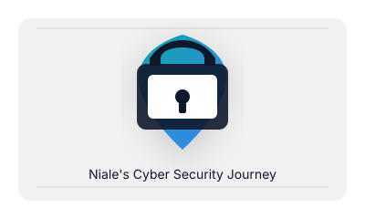

<!-- Hero image and polished header -->

  

# Niale's Cyber Security Journey

<em>Niale's learning roadmap & practical home lab — building skills from foundations to SOC operations.</em>

---

This repository is organized as a structured learning roadmap and knowledge base to support a transition into cyber security. Use the folders below as categories and expand each section with notes, labs, and writeups.

## Quick navigation

1. 01-Foundations/
2. 02-Security-Fundamentals/
3. 03-Network-Security/
4. 04-Windows-Security/
5. 05-Blue-Team/
6. 06-SIEM/
7. 07-Home-Lab/
8. 08-Projects/
9. 09-Certifications/
10. 10-Hack-The-Box/

---

## What I’ll add next

- Clear templates for notes and labs
- Project writeups and HTB reports
- Playbooks and detection rules for SIEM

---

Per your request, the Careers folder has been removed from the top-level structure. If you want it restored elsewhere, I can add it back or create a separate career folder in a different branch.
