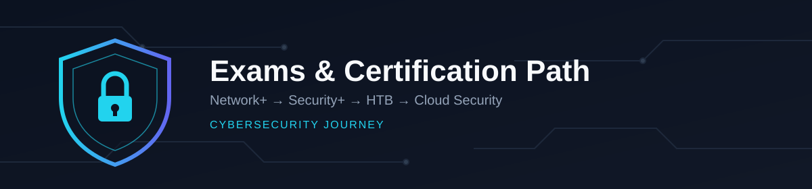

# Niale's Cyber Security Journey

This repository is organized as a structured learning roadmap and knowledge base to support a transition into cyber security. Use the links below to jump straight to a folder or section.

---

## Quick links to sections (each header links to the folder)

- [01 - Foundations](#foundations)
- [01 - Networking](#networking)
- [02 - Security Fundamentals](#security-fundamentals)
- [03 - Network Security](#network-security)
- [04 - Windows Security](#windows-security)
- [05 - Blue Team](#blue-team)
- [06 - SIEM](#siem)
- [07 - Home Lab](#home-lab)
- [08 - Projects](#projects)
- [09 - Certifications](#certifications)
- [10 - Hack The Box](#hack-the-box)
- [11 - Exams](#exams)

---

## Table of contents

1. [Description of my plan](#description-of-my-plan)
2. [How I will log progress](#how-i-will-log-progress)
3. [Exams and certification path (details)](#exams-and-certification-path-details)
4. [Where to store artifacts](#where-to-store-artifacts)

---

## Description of my plan

My goal is to move into cybersecurity with a clear, practical learning path:

1. **Start with Palo Alto Networks Cybersecurity Practitioner** (Foundational tier) — bridges networking and security concepts before diving deeper.
2. **Master networking in detail** and pass CompTIA Network+ (subnetting, routing, switching, TCP/IP, OSI model).
3. **Build deep Linux knowledge** (shell, services, permissions, networking tools, logging).
4. **Learn databases** and how data transfers across systems (ACID, replication, backups, client-server flows).
5. **Complete the Google Cybersecurity Certificate**, then CompTIA Security+.
6. **After foundational certs**, focus on hands-on practice and certifications (Hack The Box — SL1/CPTS).
7. **Add cloud certifications** (AWS / Azure) to understand cloud storage, services, IAM, and data flows.

You can find the full, detailed personal roadmap in: [PERSONAL_ROADMAP.md](PERSONAL_ROADMAP.md)

---

## How I will log progress

- **Primary tracker** (choose one): Notion (recommended) or GitHub Projects for repo-tied tasks. Keep a daily learning log and a study board.
- **Interactive Tracker**: Use [tracker.html](tracker.html) to update certification status and due dates in real-time.
- **Repo structure for artifacts:**
  - `notes/` (topic notes)
  - `labs/` (lab steps and results)
  - `captures/` (pcap files)
  - `writeups/` (HTB and lab writeups)
- I will add a `learning-log.md` entry per day under a new `notes/` folder (or use GitHub Issues/Projects for task tracking).

---

## Exams and certification path (details)

### 🚀 Start Here: Palo Alto Networks Cybersecurity Practitioner

**Foundational Tier | ~$150 | Covers: Network Security, Cloud Security, Endpoint Security, SOC Operations**

This is the ideal first cert for your transition into security. Here's why:

- **Bridges concepts**: Combines networking and security fundamentals in one exam, so you're not repeating concepts.
- **Vendor credibility**: Palo Alto is one of the most deployed firewall/security platforms in enterprise environments.
- **Realistic career path**: Maps directly to first-level security roles — SOC Analyst, Security Operations Technician, Junior Security Engineer.
- **Covers core frameworks**: AAA framework, Zero Trust concepts, MITRE ATT&CK, advanced persistent threats.
- **Practical assessment**: Mix of multiple-choice, multiple-response, drag-and-drop, and case-study questions — tests applied understanding, not just memorization.

**Best suited for**: People with some basic networking and security exposure (like you, with IT support background).

**Study domains**:
- Cybersecurity fundamentals
- Network security
- Cloud security
- Endpoint security
- SOC operations
- AAA framework & Zero Trust concepts
- MITRE ATT&CK framework
- Detection and response basics

---

### Full Certification Path (Entry → Advanced)

#### 1. Entry / Foundations
- **Palo Alto Networks Cybersecurity Practitioner** ← **START HERE**
- **CompTIA Network+** — core networking fundamentals (subnetting, TCP/IP, routing, switching).
- **Google Cybersecurity Certificate** — structured introduction to cybersecurity concepts with practical labs.
- *(Optional)* CompTIA IT Fundamentals or Google IT Support, if starting from zero IT background.

#### 2. Core security certifications
- **CompTIA Security+** — baseline security knowledge (access control, cryptography, threats/mitigation). Industry-standard screening cert.
- *(Optional)* CEH or eLearnSecurity junior-level certs for basic offensive awareness — not required, but useful if a job posting specifically asks for CEH.

#### 3. Hands-on practice & Hack The Box
- **HTB practice** — work easy → medium → hard boxes, writeup every one (even solved ones) in `10-Hack-The-Box/writeups/`.
- **HTB certifications** — CPTS (Certified Penetration Testing Specialist) is the flagship hands-on proof of skill. Confirm the exact current name/scope of the "SL1" path on HTB Academy before committing — HTB periodically renames and restructures paths.

#### 4. Cloud & specialization
- **AWS Cloud Practitioner** or **Azure Fundamentals (AZ-900)** — cloud basics.
- **AWS Solutions Architect Associate** or **Azure Administrator** — deeper cloud networking & services.
- *(Optional)* Cloud security specialty: **AWS Security Specialty** or **Azure Security Engineer (AZ-500)**.

#### 5. Advanced / professional
- **Offensive:** OSCP (Offensive Security Certified Professional) or equivalent hands-on pentesting cert.
- **Defensive:** Splunk/Elastic/Sentinel specialist certs, Certified Threat Intelligence Analyst, or advanced cloud security certs.

---

### Interactive Progress Tracker

**Use the [tracker.html](tracker.html) file to:**
- Update certification status in real-time (⬜ → 🟨 → 🟦 → ✅)
- Set and track due dates for each cert
- Add personal notes and study progress
- Export/import your progress as JSON

---

### Starter checklist template

Copy this into `checklist.md` for each new exam folder:

```markdown
- Exam name:
- Target date:
- Official objectives downloaded: [ ]
- Study materials collected: [ ]
- Lab environment ready: [ ]
- Practice exams completed (count & score):
- Exam scheduled: [ ]
- Exam passed (date):
- Post-exam writeup added to repo: [ ]
```

---

### Quick reference: why each cert is on this list

| Certification | Why it's here |
|---|---|
| Palo Alto Networks Cybersecurity Practitioner | **Start here.** Bridges networking + security. Vendor credibility. Maps to realistic first roles (SOC Analyst). |
| CompTIA Network+ | Foundation for every networking concept used across security roles |
| Google Cybersecurity Certificate | Structured, beginner-friendly entry with real labs |
| CompTIA Security+ | Baseline security cert most widely recognized by employers |
| HTB CPTS / current advanced path | Hands-on proof of real offensive skill, not just theory |
| AWS/Azure Fundamentals + Associate | Understand cloud data flows, IAM, and service architecture |
| OSCP / pentest / cloud security specialty | Advanced, specialized hands-on or cloud-security roles |

---

## Where to store artifacts

Store all technical artifacts in the repository under the appropriate folders. Example:

- `01-Networking/notes.md`
- `01-Networking/labs/lab1.md`
- `01-Networking/captures/sample1.pcap`
- `10-Hack-The-Box/writeups/box-name.md`

If you want me to reorganize the repo to add a `notes/`, `labs/`, or `captures/` top-level folder now, tell me and I will create them and add starter templates.

---

## Foundations

Work here on core IT concepts and IT support fundamentals that bridge to security.

## Networking

Deep dive into networking protocols, architecture, and troubleshooting — the foundation for every security role.

## Security Fundamentals

Cybersecurity frameworks, threat modeling, risk assessment, and compliance basics.

## Network Security

Firewalls, intrusion detection, network segmentation, VPNs, and network defense strategies.

## Windows Security

Active Directory, Windows hardening, Group Policy, Windows Defender, and endpoint security.

## Blue Team

Defensive security: log analysis, incident response, threat hunting, and detection engineering.

## SIEM

Security Information and Event Management platforms (Splunk, Microsoft Sentinel, ELK Stack) and query writing.

## Home Lab

Personal lab environment documentation: VM setups, networking, security tools, and practice scenarios.

## Projects

Portfolio projects: cloud deployments, detection rule collections, automation scripts, and security solutions.

## Certifications

Central hub for all certification checklists, study plans, and resources.

## Hack The Box

HTB machine writeups, methodology notes, and hands-on penetration testing practice.

## Exams

Official exam study materials, practice tests, and exam preparation tracking.
